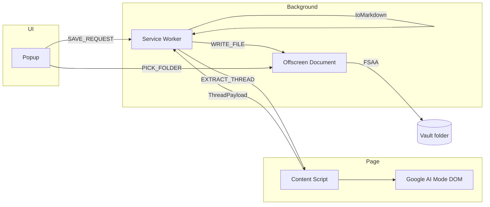

# PLAN.md — Google AI Mode → Obsidian Saver

**Версия:** 1.0  
**Статус:** Ожидает approval  
**Стек:** TypeScript, Manifest V3, Vite + `@crxjs/vite-plugin`  
**Браузеры:** Chrome 109+, Edge 109+ (Offscreen API + FSAA)

---

## 0. Контекст workspace

Репозиторий сейчас содержит только PM-документы в `docs/product/`. Код расширения создаётся с нуля в каталоге `extension/`.

**Затрагиваемые артефакты (новые):**

| Путь | Назначение |
|------|------------|
| `extension/manifest.json` | MV3 manifest |
| `extension/package.json` | deps, scripts |
| `extension/vite.config.ts` | сборка CRX |
| `extension/src/background/service-worker.ts` | оркестрация save pipeline |
| `extension/src/content/google-ai-mode.ts` | DOM detection, scroll, extract |
| `extension/src/popup/*` | UI: status, save, rename dialog, settings |
| `extension/src/offscreen/offscreen.ts` | FSAA read/write (handle persistence) |
| `extension/src/lib/*` | чистая логика: md, frontmatter, filename |
| `extension/src/types/messages.ts` | типы chrome.runtime messages |
| `docs/spike/dom-notes.md` | зафиксированные селекторы Google (после spike) |

---

## 1. Архитектура

### 1.1 Компоненты



### 1.2 Почему Offscreen Document

- **Service Worker** не имеет доступа к File System Access API.
- **Popup** может закрыться во время 5–15 с автоскролла.
- **Offscreen document** — единственный стабильный контекст MV3 для FSAA + IndexedDB с `FileSystemDirectoryHandle`.

### 1.3 Поток сохранения (happy path)

1. Popup: пользователь вводит/подтверждает имя → `SAVE_REQUEST { filename }`.
2. SW: `chrome.tabs.sendMessage(tabId, { type: 'EXTRACT_THREAD' })`.
3. Content script: `scrollToTopUntilStable()` → `extractThread()` → `ThreadPayload`.
4. SW: `buildMarkdown(payload, meta)` → string.
5. SW: `ensureOffscreen()` → `sendMessage offscreen { type: 'WRITE_FILE', filename, content }`.
6. Offscreen: `getDirectoryHandle()` из IndexedDB → `getFileHandle(name, { create: true })` → `createWritable()` → write → close.
7. SW → Popup: `SAVE_SUCCESS` / `SAVE_ERROR`.

### 1.4 Поток выбора папки

1. Popup: кнопка «Изменить папку» (user gesture).
2. Popup → Offscreen: `PICK_FOLDER`.
3. Offscreen: `showDirectoryPicker({ mode: 'readwrite' })` → save handle в IndexedDB (`idb-keyval`).
4. Offscreen → Popup: `FOLDER_SET { displayName }`.

---

## 2. Зависимости

```json
{
  "devDependencies": {
    "@crxjs/vite-plugin": "^2.x",
    "typescript": "^5.x",
    "vite": "^6.x",
    "@types/chrome": "^0.0.x"
  },
  "dependencies": {
    "turndown": "^7.x",
    "turndown-plugin-gfm": "^1.x",
    "idb-keyval": "^6.x",
    "yaml": "^2.x"
  }
}
```

| Пакет | Зачем |
|-------|-------|
| `turndown` + GFM plugin | HTML → Markdown (таблицы, strikethrough) |
| `idb-keyval` | persist `FileSystemDirectoryHandle` |
| `yaml` | безопасная сериализация frontmatter |
| `@crxjs/vite-plugin` | HMR + сборка MV3 |

**Не добавлять:** React/Vue — popup простой, vanilla TS достаточно.

---

## 3. manifest.json (черновик)

```json
{
  "manifest_version": 3,
  "name": "Google AI Mode → Obsidian",
  "version": "0.1.0",
  "description": "Save Google Search AI Mode chats to Obsidian vault as Markdown",
  "permissions": ["activeTab", "offscreen", "storage"],
  "host_permissions": ["https://www.google.com/*", "https://google.com/*"],
  "background": {
    "service_worker": "src/background/service-worker.ts",
    "type": "module"
  },
  "action": {
    "default_popup": "src/popup/popup.html",
    "default_title": "Save AI Mode chat"
  },
  "content_scripts": [
    {
      "matches": [
        "https://www.google.com/*",
        "https://google.com/*"
      ],
      "js": ["src/content/google-ai-mode.ts"],
      "run_at": "document_idle"
    }
  ],
  "web_accessible_resources": []
}
```

**Permissions rationale:**
- `activeTab` — доступ к tab без `<all_urls>`
- `offscreen` — FSAA document
- `storage` — опционально для настроек (max filename length)
- **Нет** `downloads` — не используем

---

## 4. Типы данных

### 4.1 `extension/src/types/thread.ts`

```typescript
export interface ThreadTurn {
  role: 'user' | 'ai';
  html: string;       // innerHTML блока сообщения
  plainText: string;  // для title / preview
}

export interface ThreadPayload {
  turns: ThreadTurn[];
  sourceUrl: string;
  extractedAt: string; // ISO 8601
}

export interface SaveMeta {
  filename: string;   // без .md
  sourceUrl: string;
  title: string;      // первый user turn, truncated
  date: string;       // YYYY-MM-DD
}
```

### 4.2 `extension/src/types/messages.ts`

Перечислить union всех message types: `GET_STATUS`, `STATUS_RESPONSE`, `PICK_FOLDER`, `FOLDER_SET`, `SAVE_REQUEST`, `EXTRACT_THREAD`, `THREAD_EXTRACTED`, `WRITE_FILE`, `WRITE_SUCCESS`, `WRITE_ERROR`, `SAVE_SUCCESS`, `SAVE_ERROR`.

---

## 5. Фазы реализации

---

### Phase 0: Spike DOM + FSAA (2–3 дня)

**Цель:** снять неопределённость до основной разработки.

#### 0.1 DOM spike

1. Открыть Google Search → «Режим ИИ» → провести 3+ turn диалог.
2. DevTools: найти контейнер треда, блоки user/AI, scroll container.
3. Записать в `docs/spike/dom-notes.md`:
   - URL-паттерн AI Mode (проверить query params: `udm`, `aep`, и т.д.)
   - селекторы контейнера, turn'ов, scroll root
   - признак «есть ещё история выше» (spinner, sentinel, height change)
   - RU vs EN UI («Режим ИИ» / «AI Mode»)
4. Проверить: lazy load при scroll up — замерить delay между scroll и появлением новых nodes.

**Exit criteria:** из консоли content script извлекается ≥1 turn с стабильным селектором.

#### 0.2 FSAA spike

1. Минимальная HTML-страница (или offscreen stub): `showDirectoryPicker` → write test.md → reload extension → read handle from IndexedDB → append.
2. Проверить `queryPermission` / `requestPermission` после restart браузера.
3. Проверить overwrite: `getFileHandle('x.md', { create: true })` + `createWritable()`.

**Exit criteria:** файл перезаписывается после перезапуска Chrome без повторного picker (пока permission valid).

#### 0.3 Turndown spike

1. Скопировать реальный HTML блока AI-ответа из DevTools.
2. Прогнать через Turndown + GFM.
3. Зафиксировать потери: вложенные списки, code blocks, ссылки, таблицы.
4. Добавить custom rule: `remove` для `img`, `video`, `svg` (кроме inline code).

**Exit criteria:** sample output читаем в Obsidian без критичных артефактов.

---

### Phase 1: Scaffold проекта (0.5 дня)

#### 1.1 Инициализация

```bash
cd extension
npm init -y
npm i turndown turndown-plugin-gfm idb-keyval yaml
npm i -D typescript vite @crxjs/vite-plugin @types/chrome
```

#### 1.2 Файлы

| Файл | Действие |
|------|----------|
| `extension/tsconfig.json` | `strict: true`, `moduleResolution: bundler` |
| `extension/vite.config.ts` | CRX plugin, entry points |
| `extension/manifest.json` | как в §3 |
| `extension/.gitignore` | `node_modules`, `dist` |

#### 1.3 Scripts

```json
"scripts": {
  "dev": "vite",
  "build": "tsc --noEmit && vite build",
  "load": "echo Load dist/ via chrome://extensions"
}
```

**Verify:** `npm run build` → `dist/` загружается в `chrome://extensions` без ошибок.

---

### Phase 2: Offscreen + FSAA storage (1 день)

#### 2.1 `extension/src/offscreen/offscreen.html` + `offscreen.ts`

Реализовать handlers:

| Message | Логика |
|---------|--------|
| `PICK_FOLDER` | `showDirectoryPicker` → `set('dirHandle', handle)` → response |
| `GET_FOLDER_STATUS` | handle exists? `name` if available |
| `WRITE_FILE` | get handle → verify permission → write UTF-8 → response |

#### 2.2 `extension/src/lib/fsaa-storage.ts`

```typescript
const KEY = 'vault-directory-handle';

export async function saveDirectoryHandle(handle: FileSystemDirectoryHandle): Promise<void>
export async function loadDirectoryHandle(): Promise<FileSystemDirectoryHandle | undefined>
export async function ensureWritePermission(handle: FileSystemDirectoryHandle): Promise<boolean>
```

#### 2.3 `extension/src/background/offscreen-manager.ts`

```typescript
export async function ensureOffscreenDocument(): Promise<void>
// chrome.offscreen.createDocument({ url: 'offscreen.html', reasons: ['DOM_PARSER'], justification: '...' })
```

**Edge cases:**
- Permission denied → `WRITE_ERROR { code: 'PERMISSION_DENIED' }`
- Handle missing → `WRITE_ERROR { code: 'NO_FOLDER' }`
- Invalid filename chars → sanitize в SW до отправки

**Verify:**
- [ ] Pick folder → restart browser → write без picker
- [ ] Overwrite существующего файла
- [ ] Кириллица в имени файла

---

### Phase 3: AI Mode detection (0.5 дня)

#### 3.1 `extension/src/lib/detection.ts`

```typescript
export function isGoogleHost(url: string): boolean
export function isAiModeUrl(url: string): boolean   // из spike: query params
export function isAiModeDom(): boolean              // UI marker в DOM
export function detectAiMode(url: string): boolean  // URL && DOM
```

**Логика (уточнить после spike):**
- Host: `google.<tld>`
- URL: наличие AI Mode param (TBD в `dom-notes.md`)
- DOM: элемент с текстом `Режим ИИ` / `AI Mode` в активном tab bar **или** data-attribute контейнера

#### 3.2 `extension/src/content/google-ai-mode.ts`

- Слушать `GET_STATUS` → `{ aiMode: boolean, turnCount?: number }`
- Не inject UI

#### 3.3 Popup status line

При `popup` open → `GET_STATUS` на active tab → enable/disable Save.

**Verify:**
- [ ] AI Mode tab → enabled
- [ ] Regular search / gemini.google.com → disabled, без alert

---

### Phase 4: Scroll + Extract (2 дня) — критический путь

#### 4.1 `extension/src/lib/scroller.ts`

```typescript
export async function scrollToTopUntilStable(
  scrollRoot: Element,
  options?: { maxIterations?: number; settleMs?: number; iterationDelayMs?: number }
): Promise<void>
```

**Алгоритм:**
1. Найти scroll container (из spike).
2. Loop (max 50 итераций):
   - `scrollTop = 0` или `scrollBy(0, -viewportHeight)`
   - `await sleep(iterationDelayMs)` (300–500 ms)
   - если `scrollHeight` не вырос и нет loading indicator → `settleMs` wait → break
3. Timeout 30 s → resolve с warning flag (не throw).

#### 4.2 `extension/src/lib/extractor.ts`

```typescript
export function findScrollRoot(): Element | null
export function extractTurns(): ThreadTurn[]
```

**Правила извлечения:**
- Каждый turn — пара role + content node (селекторы из spike).
- `role`: эвристика по DOM (user bubble vs AI response) — зафиксировать в `dom-notes.md`.
- Пропустить: `img`, `video`, `figure` (strip из HTML до turndown).
- `plainText`: `element.innerText.trim()`.

#### 4.3 Content script handler `EXTRACT_THREAD`

```typescript
async function handleExtract(): Promise<ThreadPayload> {
  await scrollToTopUntilStable(findScrollRoot()!);
  const turns = extractTurns();
  return { turns, sourceUrl: location.href, extractedAt: new Date().toISOString() };
}
```

**Edge cases:**
- `turns.length === 0` → error `EMPTY_THREAD`
- scroll root not found → `DOM_CHANGED`
- mid-generation streaming → save partial (document in PRD); optional `isStreaming` flag in Phase 2

**Verify:**
- [ ] Тред 5 turn → все 5 в payload
- [ ] Тред 20+ turn с lazy load → все turn после scroll
- [ ] Порядок: user → ai → user → ai

---

### Phase 5: Markdown pipeline (1 день)

#### 5.1 `extension/src/lib/markdown.ts`

```typescript
export function createTurndownService(): TurndownService
// + gfm plugin
// + remove img/video
// + keep links

export function turnToMarkdown(turn: ThreadTurn): string
// `## User\n\n` + turndown(turn.html)

export function buildMarkdown(payload: ThreadPayload, meta: SaveMeta): string
```

#### 5.2 `extension/src/lib/frontmatter.ts`

```typescript
import { stringify } from 'yaml';

export function buildFrontmatter(meta: { title: string; date: string; source_url: string }): string
```

- `title`: escape quotes в YAML string.
- `date`: `YYYY-MM-DD` (local или UTC — зафиксировать local).
- Порядок полей: `title`, `date`, `source_url`.

#### 5.3 `extension/src/lib/filename.ts`

```typescript
const MAX_LEN = 80;

export function buildDefaultFilename(firstUserMessage: string, date: Date): string
export function sanitizeFilename(name: string): string
// Заменить: \ / : * ? " < > | → _
// Trim, collapse spaces
```

**Verify:**
- [ ] Sample thread → valid .md открывается в Obsidian
- [ ] Code block с ```python сохраняет language
- [ ] Таблица → GFM table
- [ ] Ссылка → `[text](url)`

---

### Phase 6: Service Worker orchestration (1 день)

#### 6.1 `extension/src/background/service-worker.ts`

Handlers:

| Incoming | Action |
|----------|--------|
| `GET_FOLDER_STATUS` | proxy to offscreen |
| `PICK_FOLDER` | ensureOffscreen → forward |
| `SAVE_REQUEST` | full pipeline |

**SAVE_REQUEST pseudocode:**

```typescript
async function onSaveRequest({ filename }, sender) {
  const tabId = sender.tab?.id ?? (await getActiveGoogleTab())?.id;
  if (!tabId) return error('NO_TAB');

  const status = await sendTabMessage(tabId, { type: 'GET_STATUS' });
  if (!status.aiMode) return error('NOT_AI_MODE');

  const payload = await sendTabMessage(tabId, { type: 'EXTRACT_THREAD' });
  if (!payload.turns.length) return error('EMPTY_THREAD');

  const meta = buildMeta(payload, filename);
  const content = buildMarkdown(payload, meta);

  await ensureOffscreenDocument();
  await sendOffscreen({ type: 'WRITE_FILE', filename: meta.filename + '.md', content });

  return { type: 'SAVE_SUCCESS', filename: meta.filename };
}
```

**Error taxonomy:**

| Code | UI |
|------|-----|
| `NOT_AI_MODE` | disabled (не должно случиться) |
| `NO_FOLDER` | prompt pick folder |
| `PERMISSION_DENIED` | «Выберите папку снова» |
| `EMPTY_THREAD` | «Нечего сохранять» |
| `DOM_CHANGED` | «Не удалось извлечь чат» |
| `TIMEOUT` | «Попробуйте ещё раз» |

**Verify:** end-to-end save из SW unit test mock + manual E2E.

---

### Phase 7: Popup UI (1 день)

#### 7.1 `extension/src/popup/popup.html`

Структура:
- `#status` — AI Mode / folder status
- `#filename-input` — text input (hidden until save)
- `#btn-save` — primary
- `#btn-pick-folder` — settings
- `#spinner` — hidden by default
- `#error` — hidden by default

#### 7.2 `extension/src/popup/popup.ts`

**On load:**
1. Query active tab.
2. `GET_STATUS` → set status, enable/disable Save.
3. `GET_FOLDER_STATUS` → show folder name or «Папка не выбрана».

**On Save click:**
1. Compute default filename from tab (lightweight: `GET_FIRST_MESSAGE` или reuse STATUS with first turn preview).
   - *Оптимизация:* не извлекать весь тред дважды — первый extract только при confirm filename, либо STATUS возвращает `firstMessage` из DOM без full scroll (quick read last/first visible). **Рекомендация:** при открытии rename dialog сделать quick `GET_PREVIEW` (first user message из DOM без scroll); full scroll только после confirm.
2. Show rename dialog с prefilled name.
3. On confirm → show spinner, disable buttons → `SAVE_REQUEST`.
4. On success → hide spinner, brief «Сохранено».
5. On error → show message.

**UX details:**
- Enter в input → confirm save
- Esc → cancel dialog
- Popup min-width 320px

**Verify:**
- [ ] Disabled вне AI Mode
- [ ] Spinner блокирует double-click
- [ ] Rename + overwrite flow

---

### Phase 8: Hardening (1–2 дня)

| Task | Файл | Детали |
|------|------|--------|
| Double-save guard | `service-worker.ts` | mutex `savingInProgress` |
| Scroll timeout | `scroller.ts` | return `{ partial: true }` → optional warning |
| Selector versioning | `extractor.ts` | `SELECTOR_VERSION = 1`, fallback selectors array |
| Locale fallback | `detection.ts` | `['Режим ИИ', 'AI Mode']` |
| Logging | `lib/logger.ts` | `debug` only if `storage.debug` — no content logging in prod |
| Icons | `extension/public/icons/` | 16, 48, 128 px |

**Manual test matrix:**

| # | Case | Expected |
|---|------|----------|
| T1 | First save, no folder | Folder picker → save |
| T2 | Repeat save same name | Overwrite |
| T3 | RU Google AI Mode | OK |
| T4 | EN Google AI Mode | OK |
| T5 | Long thread 30+ turns | All turns, < 20s |
| T6 | Code + table in response | MD intact |
| T7 | Non-Google tab | Disabled |
| T8 | Regular Google search | Disabled |
| T9 | Revoke folder permission | Re-pick |
| T10 | Cyrillic filename | OK on Windows |

---

### Phase 9: Build & sideload (0.5 дня)

1. `npm run build` → `extension/dist/`.
2. README: как загрузить unpacked в Chrome/Edge.
3. Checklist permissions для Web Store (future).

---

## 6. Структура каталогов (итог)

```
extension/
├── manifest.json
├── package.json
├── tsconfig.json
├── vite.config.ts
├── public/
│   └── icons/{16,48,128}.png
└── src/
    ├── background/
    │   ├── service-worker.ts
    │   └── offscreen-manager.ts
    ├── content/
    │   └── google-ai-mode.ts
    ├── popup/
    │   ├── popup.html
    │   ├── popup.css
    │   └── popup.ts
    ├── offscreen/
    │   ├── offscreen.html
    │   └── offscreen.ts
    ├── lib/
    │   ├── detection.ts
    │   ├── scroller.ts
    │   ├── extractor.ts
    │   ├── markdown.ts
    │   ├── frontmatter.ts
    │   ├── filename.ts
    │   ├── fsaa-storage.ts
    │   └── logger.ts
    └── types/
        ├── thread.ts
        └── messages.ts
docs/
├── product/          # уже есть
└── spike/
    └── dom-notes.md  # после Phase 0
```

---

## 7. Риски и mitigation (технические)

| Риск | Mitigation |
|------|------------|
| Google меняет DOM | `dom-notes.md` + массив fallback selectors; быстрый patch release |
| FSAA permission revoked | `ensureWritePermission`; graceful re-pick |
| Popup closes during save | весь long work в content script + offscreen, не в popup |
| Двойной extract (preview + full) | `GET_PREVIEW` без scroll, `EXTRACT_THREAD` со scroll |
| Turndown ломает вложенный HTML | unit tests на 5+ real HTML snapshots |
| CORS / CSP Google | content script isolated world — OK для DOM read |

---

## 8. Критерии готовности MVP

- [ ] Все P0 user stories из `docs/product/04-user-stories.md` закрыты
- [ ] Manual test matrix T1–T10 пройдена
- [ ] `npm run build` без ошибок
- [ ] Нет отправки данных на внешние серверы
- [ ] p95 save ≤ 20 s на треде 30 turn (ручной замер)

---

## 9. Порядок работ (хронология)

```
Phase 0 (spike) → Phase 1 (scaffold) → Phase 2 (FSAA) → Phase 3 (detection)
    → Phase 4 (extract) → Phase 5 (markdown) → Phase 6 (SW orchestration)
    → Phase 7 (popup) → Phase 8 (hardening) → Phase 9 (build)
```

**Оценка:** 8–10 рабочих дней solo dev.

---

## 10. Следующий шаг

После approval:
1. Начать **Phase 0.1** — DOM spike в живом Google AI Mode.
2. Параллельно **Phase 1** scaffold (не блокирует spike).

**Скажи «go»** — начну с Phase 0 + scaffold.
