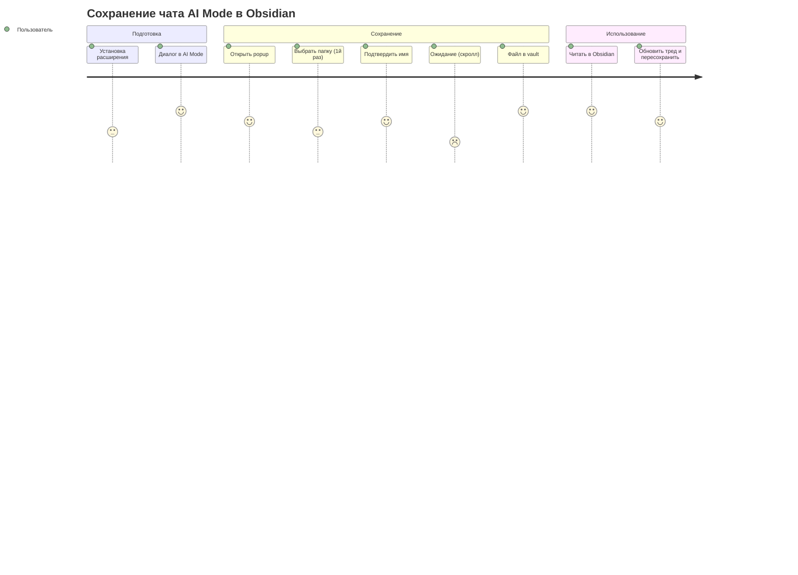

# User Journey Map (UJM / CJM)

**Продукт:** Google AI Mode → Obsidian Saver  
**Персона:** Исследователь в Obsidian (Persona A)  
**Сценарий:** Первое и повторное сохранение чата

---

## Карта пути (основной сценарий)

| Stage | Действие пользователя | Touchpoint | Мысли | Эмоция | Pain points | Opportunities |
|-------|----------------------|------------|-------|--------|-------------|---------------|
| **1. Discover** | Ищет способ сохранять AI Mode в Obsidian | Reddit, форум Obsidian, Store search | «Опять copy-paste на 20 минут» | 😤 Frustrated | Нет готового решения | SEO: «google ai mode obsidian» |
| **2. Install** | Устанавливает из Chrome Web Store | Store listing, permissions prompt | «Надеюсь, не шпион» | 🤔 Cautious | Страх лишних permissions | Минимальные permissions, privacy note |
| **3. Research** | Ведёт диалог в Google AI Mode | google.com, вкладка «Режим ИИ» | «Отличный ответ, надо в vault» | 😊 Engaged | Контент «заперт» в браузере | — |
| **4. Trigger** | Кликает иконку расширения | Browser toolbar → popup | «Сохранить одним кликом» | 🙂 Hopeful | Не знает, сработает ли | Чёткий статус «AI Mode ✓» |
| **5. Setup** *(first time)* | Первый Save → выбор папки | FSAA folder picker | «Укажу папку Inbox vault» | 😐 Neutral | Лишний шаг, но понятный | Запомнить путь в settings |
| **6. Name** | Редактирует / подтверждает имя | Rename dialog в popup | «Имя ок, Enter» | 🙂 In control | Длинные имена обрезаны | Preview первых строк треда (v2) |
| **7. Wait** | Ждёт 5–15 сек | Spinner в popup | «Скроллит…» | ⏳ Impatient | Неясно, сколько ждать | Progress: «Загрузка 12 сообщений…» (v2) |
| **8. Success** | Файл в vault | Obsidian, файл .md | «Готово, можно линковать» | 😄 Satisfied | — | Toast «Сохранено: filename.md» |
| **9. Reuse** | Открывает в Obsidian, дополняет заметки | Obsidian graph, backlinks | «Это часть моей KB» | 😊 Productive | — | Шаблон frontmatter с tags (v2) |
| **10. Update** | Продолжает тред, Save снова | Popup, тот же filename | «Обновлю файл» | 🙂 Efficient | Риск случайной перезаписи | Confirm overwrite (опционально v2) |

---

## Альтернативные пути

### Path B — Не AI Mode

```
Клик popup → Save disabled → статус «Не AI Mode» → пользователь уходит без действий
```
**Эмоция:** нейтральная (by design, без раздражающих alert'ов)

### Path C — Отозван доступ к папке

```
Save → ошибка FSAA → «Выберите папку снова» → folder picker → успех
```
**Pain:** неожиданно после обновления браузера / очистки данных

### Path D — Google изменил UI

```
Save → spinner → ошибка extraction → «Обновите расширение»
```
**Pain:** полная блокировка ценности; критичный момент для retention

---

## Journey: Повторный пользователь (нет setup)

| Stage | Отличие от первого раза |
|-------|-------------------------|
| Setup | Пропускается — папка уже выбрана |
| Name | Диалог всё равно показывается (можно быстро Enter) |
| Wait | Привычка, терпимость выше |
| Update | Осознанная перезапись файла |

---

## Emotional Arc

```
Frustration (discover) → Caution (install) → Hope (trigger) →
Brief friction (setup/name) → Impatience (wait) →
Satisfaction (success) → Productivity (reuse)
```

---

## Service Blueprint (упрощённый)

| User action | Frontstage (UI) | Backstage | Support systems |
|-------------|-----------------|-----------|-----------------|
| Open popup | Popup: status, Save btn | Content script ping | `chrome.tabs` |
| Click Save | Rename dialog | — | — |
| Confirm name | Spinner | Content script: scroll + parse | DOM selectors |
| — | — | Service worker: HTML→MD | Turndown / custom converter |
| — | Success state | FSAA write file | IndexedDB (handle) |
| Open Obsidian | .md in vault | — | Local filesystem |

---

## Moments of Truth

| # | Moment | Make or break |
|---|--------|---------------|
| 1 | **First save success** | Если fail — uninstall |
| 2 | **MD quality in Obsidian** | Если каша — не вернётся |
| 3 | **Save time < 20s** | Если > 30s — раздражение |
| 4 | **Google DOM break** | Нужен быстрый fix (< 48h) |

---

## CJM Metrics по этапам

| Stage | Metric |
|-------|--------|
| Discover → Install | Store conversion rate |
| Install → First save | Time to first save (TTFV) |
| First save → Second save | D7 retention |
| Success → Reuse in Obsidian | % users with 2+ saves/week |
| Error paths | Error rate by type |

---

## Diagram (Mermaid)


